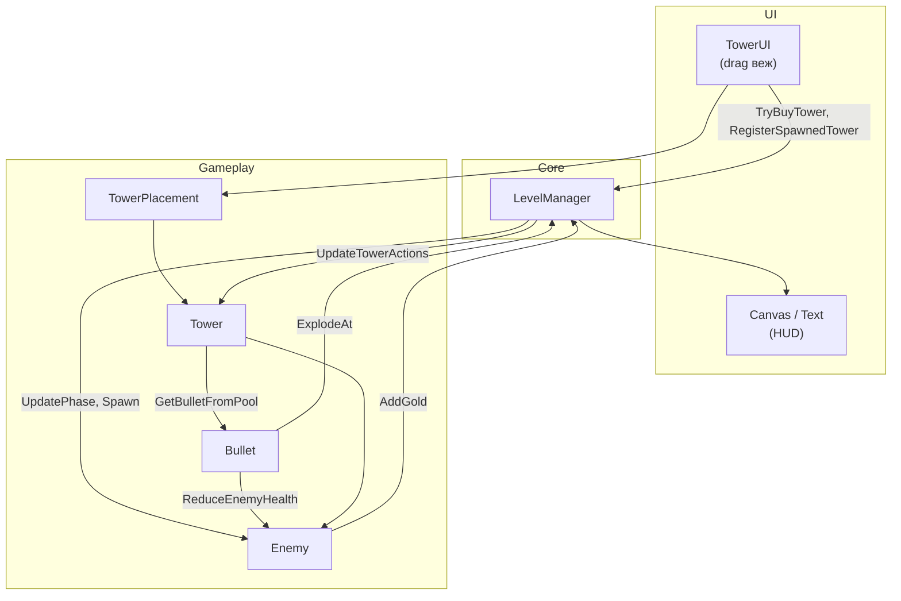

# Звіт з курсової / лабораторної роботи  
## 2D-гра «Tower Defense» (захист замку від хвиль ворогів)

**Автор(и):** Пристая Іван 
**Дата:** травень 2026  
**Репозиторій:** https://github.com/qreqit/tower-defence-.git  
**Движок:** Unity **6000.4.5f1** (Unity 6)  
**Мова програмування:** C#  
**Сцена гри:** `Assets/Scenes/Level1.unity`

---

## Зміст

1. [Що це за проєкт](#1-що-це-за-проєкт)
2. [Системні вимоги](#2-системні-вимоги)
3. [Як завантажити проєкт](#3-як-завантажити-проєкт)
4. [Як встановити Unity (перший раз)](#4-як-встановити-unity-перший-раз)
5. [Як відкрити проєкт у редакторі](#5-як-відкрити-проєкт-у-редакторі)
6. [Як запустити гру в редакторі (без збірки)](#6-як-запустити-гру-в-редакторі-без-збірки)
7. [Як зібрати гру в окремий файл (build)](#7-як-зібрати-гру-в-окремий-файл-build)
8. [Як грати: керування та правила](#8-як-грати-керування-та-правила)
9. [Структура проєкту](#9-структура-проєкту)
10. [Опис реалізованої роботи (що зроблено)](#10-опис-реалізованої-роботи-що-зроблено)
11. [Архітектура та взаємодія скриптів](#11-архітектура-та-взаємодія-скриптів)
12. [Типи веж, ворогів і механіки](#12-типи-веж-ворогів-і-механіки)
13. [Типові проблеми та їх вирішення](#13-типові-проблеми-та-їх-вирішення)
14. [Висновки](#14-висновки)

---

## 1. Що це за проєкт

Це повноцінна **2D-гра жанру tower defense** (захист вежами), створена в **Unity**. Гравець захищає замок від **10 хвиль** ворогів: між хвилями є **фаза підготовки** (15 секунд), коли можна **перетягувати вежі** на карту; під час бою вежі **автоматично стріляють**, вороги йдуть по **заданому маршруту** (waypoints). Є **золото**, **життя**, **пауза**, **звукові ефекти**, **частинкові ефекти** вибухів і смерті ворогів, **український інтерфейс** (HUD).

Проєкт — це **вихідний код + сцена + префаби + спрайти + звуки**, а не готовий `.exe` у репозиторії. Щоб гра запрацювала, потрібно **відкрити проєкт у Unity** (запуск у редакторі) або **зібрати build** (розділ 7).

---

## 2. Системні вимоги

| Компонент | Мінімум | Рекомендовано |
|-----------|---------|---------------|
| ОС | Windows 10/11, Ubuntu 20.04+, macOS 12+ | Актуальна LTS-версія ОС |
| RAM | 8 ГБ | 16 ГБ |
| Диск | ~15 ГБ вільного місця (Unity Hub + редактор + проєкт) | 25+ ГБ |
| Відео | GPU з підтримкою DirectX 11 / Vulkan / Metal | Дискретна відеокарта |
| Unity | **Точно 6000.4.5f1** | Та сама версія через Unity Hub |

**Важливо:** версія Unity вказана в файлі `ProjectSettings/ProjectVersion.txt`. Якщо відкрити проєкт у **іншій** версії Unity, редактор може довго переконвертовувати файли або видати помилки компіляції. Для перевірки викладачем найнадійніше використовувати **ту саму версію 6000.4.5f1**.

---

## 3. Як завантажити проєкт

### Варіант А — через Git (якщо встановлено Git)

1. Встановіть Git: https://git-scm.com/downloads  
2. Відкрийте термінал (PowerShell, cmd, Terminal).  
3. Перейдіть у папку, куди хочете покласти проєкт, наприклад:
   ```bash
   cd ~/Documents
   ```
4. Клонуйте репозиторій:
   ```bash
   git clone https://github.com/qreqit/tower-defence-.git
   cd tower-defence-
   ```
5. Переконайтеся, що всередині є папки `Assets`, `ProjectSettings`, `Packages` і файл `ProjectSettings/ProjectVersion.txt` з рядком `6000.4.5f1`.

### Варіант Б — ZIP з GitHub (без Git)

1. Відкрийте в браузері: https://github.com/qreqit/tower-defence-  
2. Натисніть зелену кнопку **Code** → **Download ZIP**.  
3. Розпакуйте архів у зручне місце, наприклад `C:\Projects\tower-defence-` або `~/Documents/tower-defence-`.  
4. У розпакованій папці мають бути `Assets`, `ProjectSettings`, `Packages`.

**Не видаляйте** папку `Library` після першого відкриття в Unity — вона створюється автоматично і прискорює наступні запуски (у Git її немає, це нормально).

---

## 4. Як встановити Unity (перший раз)

1. Завантажте **Unity Hub**: https://unity.com/download  
2. Установіть Hub і увійдіть у обліковий запис Unity (Personal — безкоштовна ліцензія для навчання).  
3. У Hub відкрийте **Installs** → **Install Editor**.  
4. У списку версій знайдіть **Unity 6** → **6000.4.5f1** (якщо немає — у **Archive** або через пошук версії на https://unity.com/releases/editor/archive).  
5. Під час установки оберіть модулі:
   - **Windows Build Support** (якщо збиратимете `.exe` на Windows);
   - **Linux Build Support** (якщо збиратимете на Linux);
   - **Mac Build Support** (якщо збиратимете на macOS).
6. Дочекайтеся завершення установки (може зайняти 20–40 хвилин).

---

## 5. Як відкрити проєкт у редакторі

1. Запустіть **Unity Hub**.  
2. **Projects** → **Open** → **Add project from disk**.  
3. Виберіть **кореневу папку** проєкту (ту, де лежать `Assets` і `ProjectSettings`, **не** вкладену папку `Assets`).  
4. Hub запропонує версію — оберіть **6000.4.5f1**. Якщо версії немає — спочатку виконайте [розділ 4](#4-як-встановити-unity-перший-раз).  
5. Натисніть **Open**.  
6. **Перше відкриття** може тривати **5–15 хвилин**: Unity імпортує спрайти, створює папку `Library`, компілює скрипти. Внизу справа має зникнути індикатор завантаження, у **Console** не повинно бути червоних помилок (жовті попередження інколи допустимі).  
7. У вікні **Project** перейдіть: `Assets` → `Scenes` → двічі клацніть **`Level1`**, щоб сцена відкрилася в **Hierarchy**.

Якщо з’явиться діалог **Enter Safe Mode** через помилки — відкрийте **Window → General → Console**, скопіюйте текст помилки; найчастіша причина — **не та версія Unity**.

---

## 6. Як запустити гру в редакторі (без збірки)

Це найпростіший спосіб показати гру викладачу, якщо на комп’ютері встановлено Unity.

1. Переконайтеся, що відкрита сцена **Level1** (вкладка сцени вгорі).  
2. У **Build Settings** (`File → Build Settings`) сцена **Level1** має бути в списку **Scenes In Build** з галочкою (у проєкті вже налаштовано в `ProjectSettings/EditorBuildSettings.asset`).  
3. Натисніть кнопку **Play** (трикутник) у верхній панелі редактора або клавішу **Ctrl+P** (macOS: **Cmd+P**).  
4. Гра запуститься у вікні **Game**. Для зручності виберіть вкладку **Game** і при потребі змініть **Aspect Ratio** (наприклад 16:9).  
5. Щоб зупинити — знову **Play** / **Ctrl+P**.

**Очікуваний результат:** з’являється карта, знизу — панель з 4 типами веж і цінами, зверху — текст українською (золото, життя, фаза, вороги), через ~15 с починається перша хвиля.

---

## 7. Як зібрати гру в окремий файл (build)

Збірка потрібна, щоб запускати гру **без Unity Editor** (подвійний клік по `.exe` або бінарнику на Linux).

### 7.1. Підготовка

1. Відкрийте проєкт у Unity **6000.4.5f1**.  
2. Відкрийте сцену **Level1**.  
3. Меню **File → Build Settings**.  
4. У блоці **Scenes In Build** має бути **Assets/Scenes/Level1** з увімкненою галочкою. Якщо сцени немає — натисніть **Add Open Scenes**.  
5. У списку **Platform** виберіть цільову платформу (наприклад **Windows** або **Linux**).  
6. Натисніть **Switch Platform** і дочекайтеся завершення (один раз може зайняти кілька хвилин).

### 7.2. Windows (.exe)

1. **Platform:** PC, Mac & Linux Standalone → **Windows**.  
2. **Architecture:** x86_64.  
3. Натисніть **Build** (або **Build And Run**).  
4. Створіть порожню папку, наприклад `Builds/Windows/`.  
5. Збережіть файл як `TowerDefense.exe` (ім’я може бути будь-яким).  
6. Unity скопіює поруч папку `*_Data` і потрібні DLL. **Запускати потрібно саме `.exe` з цієї папки**, разом із `_Data` (не переносити лише один файл).

**Запуск на Windows:** подвійний клік по `TowerDefense.exe`. Якщо SmartScreen блокує — «Додаткова інформація» → «Виконати все одно» (для навчального build це типово).

### 7.3. Linux

1. **Platform:** Linux.  
2. **Build** у папку, наприклад `Builds/Linux/`.  
3. Unity створить виконуваний файл (наприклад `TowerDefense.x86_64`) і папку `*_Data`.  
4. У терміналі:
   ```bash
   chmod +x TowerDefense.x86_64
   ./TowerDefense.x86_64
   ```

### 7.4. macOS

1. **Platform:** macOS → **Build** → отримаєте `.app` bundle.  
2. Запуск: відкрити з Finder; при блокуванні Gatekeeper — ПКМ → Open.

### 7.5. Перевірка після збірки

- Гра стартує на **Level1**, HUD українською, вежі перетягуються в фазі підготовки.  
- Клавіша **ESC** — пауза, **R** — перезапуск рівня.  
- Якщо екран чорний — переконайтеся, що в Build Settings додана сцена **Level1**.

---

## 8. Як грати: керування та правила

### Керування

| Дія | Як зробити |
|-----|------------|
| Поставити вежу | У **фазі підготовки** (зелений текст зверху) перетягніть іконку вежі з нижньої панелі на **зелену зону** на карті |
| Скасувати установку | Відпустіть вежу **не** на зоні — вона зникне, золото не спишеться |
| Пауза | **ESC** |
| Продовжити | Знову **ESC** |
| Перезапуск рівня | **R** (працює і в редакторі, і в build) |
| Після перемоги/поразки | Кнопки на панелі (скрипт `PlayAgain`) — перезавантаження сцени |

### Правила (налаштування за замовчуванням у `LevelManager`)

- **Життя:** 20. Кожен ворог, що дійшов до кінця шляху, забирає **1** життя. При 0 — поразка.  
- **Стартове золото:** 380.  
- **Хвилі:** 10. Перша хвиля — **10** ворогів, кожна наступна +**10** (друга — 20, третя — 30, …).  
- **Підготовка:** **15** секунд перед кожною хвилею (і перед першою). У цей час **можна** ставити вежі; під час бою — **ні**.  
- **Перемога:** вижити всі 10 хвиль (останні вороги знищені або пройшли шлях — після очищення останньої хвилі).  
- **Бонус золота:** після очищення хвилі — бонус (базово 40, зростає з номером хвилі).  
- **Золото за вбивство:** залежить від типу ворога (див. розділ 12).

### Поради гравцю

- Ставте **льодяну (Freezer)** вежу на ділянках, де вороги довше йдуть по прямій.  
- **Гармата (Cannon)** ефективна проти **орків** (багато HP).  
- **Маг (Mage)** завдає **урон по площі** (splash).  
- **Лучник (Archer)** — швидка атака, добре проти **гоблінів**.

---

## 9. Структура проєкту

```
tower-defence-/
├── Assets/
│   ├── Scenes/
│   │   └── Level1.unity          # Головна (і єдина) ігрова сцена
│   ├── Scripts/                  # Логіка гри (C#)
│   │   ├── LevelManager.cs       # Хвилі, золото, життя, HUD, пули
│   │   ├── Tower.cs              # Вежі, стрільба, вибір цілі
│   │   ├── Enemy.cs              # Вороги, рух, HP, уповільнення
│   │   ├── TowerUI.cs            # Drag-and-drop магазин веж
│   │   ├── TowerPlacement.cs     # Зони установки
│   │   ├── Bullet.cs             # Снаряди
│   │   ├── AudioPlayer.cs        # Звуки
│   │   ├── ExplosionFx.cs        # Частинки
│   │   ├── UiFont.cs             # Шрифт HUD (DejaVu Sans)
│   │   └── PlayAgain.cs          # Кнопки після кінця гри
│   ├── Prefabs/                  # Вежі, вороги, кулі, UI слот
│   ├── Sprites/                  # Графіка (тайли, вежі, вороги)
│   ├── Audios/                   # hit-enemy.ogg, enemy-die.ogg
│   └── Resources/Fonts/          # DejaVuSans.ttf для UI
├── ProjectSettings/
│   └── ProjectVersion.txt        # Версія Unity 6000.4.5f1
├── Packages/manifest.json        # Залежності Unity (2D, UI, Tilemap)
└── ZVIT.md                       # Цей звіт
```

**Скрипти:** 10 файлів C# у `Assets/Scripts/`.  
**Префаби веж:** `Tower Variant 1` … `4` (лучник, гармата, freezer, маг).  
**Префаби ворогів:** `Enemy Variant 1` … `3` (гоблін, орк, привид).

---

## 10. Опис реалізованої роботи (що зроблено)

Нижче — **опис уже виконаної роботи**, а не план майбутніх завдань.

### 10.1. Ігровий цикл і менеджер рівня

Реалізовано центральний клас **`LevelManager`** (патерн singleton через `Instance`), який керує всім матчем:

- Дві фази: **Preparation** (підготовка) та **Combat** (бій).  
- Таймер підготовки **15 с** (`_preparationDuration`), відлік через `Time.unscaledDeltaTime`, щоб пауза не змішувала таймер.  
- **10 раундів** (`_totalRounds`); після кожної переможної хвилі (усі вороги знищені або деактивовані) — знову підготовка, інакше після 10-ї — **перемога**.  
- Генерація хвиль: кількість ворогів `10 + (round-1)*10`, випадковий вибір типу з **зміною ваг** (на ранніх хвилях більше гоблінів, на пізніх — орків і привидів).  
- Спавн з **черги** (`Queue<Enemy>`) з інтервалом ~1.15 с між появами.  
- **Object pooling** для ворогів і куль — повторне використання об’єктів замість постійного `Instantiate`/`Destroy`.  
- Шлях ворогів: масив `_enemyPaths` або **автозбір** з об’єктів сцени з іменами `Way n (0)`, `Way n (1)`, … (`BuildPathsFromWayObjects`).  
- **HUD** українською: золото, життя, кількість ворогів у хвилі, скільки хвиль залишилось, рядок фази (підготовка / бій / пауза).  
- **Пауза** (`ESC`): `Time.timeScale = 0`.  
- **Перезапуск** (`R`): перезавантаження активної сцени.  
- **Кінець гри:** панель з текстом "You Win!" / "You Lose!".

### 10.2. Система веж

- **Чотири типи** веж з різними параметрами (швидкість стрільби, урон, дальність, ціна), задані в `Tower.cs` через внутрішні архетипи (Archer, Cannon, Freezer, Mage) за іменем префаба.  
- **Магазин:** для кожного префаба створюється UI-елемент (`InstantiateAllTowerUI`), ціна показується на кнопці.  
- **Встановлення:** drag-and-drop (`TowerUI` + `IBeginDragHandler` / `IDragHandler` / `IEndDragHandler`). Купівля лише якщо достатньо золота (`TryBuyTower`) і лише у фазі підготовки.  
- **Зони:** `TowerPlacement` через `OnTriggerEnter2D` / `Exit2D` фіксує позицію на слоті; `LockPlacement` закріплює вежу.  
- **Заміна:** нова вежа на тому ж місці знищує стару (`ReplaceTowerAtSamePosition`).  
- **Стрільба:** пошук цілі в радіусі, режими пріоритету (`TargetingMode`: найбільший прогрес по шляху, найближчий, найдальший, найслабший, найсильніший).  
- **Freezer** застосовує **уповільнення**; **Mage** — **splash-урон** через `LevelManager.ExplodeAt`.

### 10.3. Вороги

- Три архетипи: **Goblin** (швидкий, мало HP), **Orc** (повільний, багато HP), **Ghost** (імунітет до slow).  
- Рух `MoveTowards` по waypoints; поворот спрайта за напрямком руху.  
- **Смуга здоров’я** (два `SpriteRenderer`).  
- Нагорода золотом при вбивстві (`OnDisable` + прапор `_isKilledByDamage`).  
- Прогрес по шляху для таргетингу веж (`GetPathProgressScore`).

### 10.4. Снаряди та ефекти

- **`Bullet`:** політ до цілі, урон при зіткненні, опційний splash і slow.  
- **`ExplosionFx`:** процедурні `ParticleSystem` (смерть ворога, удар, магічний вибух) без окремих префабів FX.  
- **`AudioPlayer`:** singleton, `PlaySFX("hit-enemy")`, `PlaySFX("enemy-die")`.

### 10.5. Інтерфейс і локалізація

- Тексти HUD **українською** (життя, золото, фази, вороги).  
- **`UiFont`:** шрифт `Resources/Fonts/DejaVuSans`, резерв — системні шрифти або вбудований Unity, щоб кирилиця відображалась у build на Linux/Windows.

### 10.6. Контент і сцена

- Рівень **Level1**: tilemap, декорації, замок, шлях `Way n (*)`, зони `TowerPlacement`, камера, Canvas з UI, об’єкт з `LevelManager` і посиланнями на префаби.  
- Графіка та звуки підключені через префаби та Inspector (SerializeField).

### 10.7. Технічні покращення (за історією комітів)

- Налаштовано **Build Settings** зі сценою Level1.  
- Виправлено помилки компіляції, додано **паузу** та оновлено HUD.  
- Додано **аудіо**, **префаби**, **сцену**, шрифт для коректного тексту.

---

## 11. Архітектура та взаємодія скриптів

Схема основного потоку даних:



**Кожен кадр (коли гра не на паузі і не скінчена):**

1. `LevelManager.Update` → оновлення фази, спавн, рух ворогів.  
2. Для кожної вежі: `CheckNearestEnemy` → `ShootTarget`.  
3. Кулі в `FixedUpdate` летять до цілі; при попаданні — урон / вибух / slow.

---

## 12. Типи веж, ворогів і механіки

### Вежі (ціни та роль)

| Тип | Префаб (орієнтовно) | Ціна | Урон | Дальність | Особливість |
|-----|---------------------|------|------|-----------|-------------|
| Лучник | Tower Variant 1 | 100 | 2 | 5.5 | Швидка стрільба, ціль — найбільший прогрес по шляху |
| Гармата | Tower Variant 2 | 200 | 15 | 9.0 | Повільна, сильний урон, ціль — найсильніший ворог |
| Freezer | Tower Variant 3 | 120 | 1 | 5.25 | Уповільнення ворогів |
| Маг | Tower Variant 4 | 150 | 5 | 3.65 | Splash-радіус ~2.15, урон по площі |

### Вороги

| Тип | Префаб | HP | Швидкість | Золото | Примітка |
|-----|--------|-----|-----------|--------|----------|
| Гоблін | Enemy Variant 1 | 4 | 2.35 | 10 | Масово на ранніх хвилях |
| Орк | Enemy Variant 2 | 38 | 0.82 | 25 | «Танк» |
| Привид | Enemy Variant 3 | 12 | 1.48 | 20 | Не отримує slow |

---

## 13. Типові проблеми та їх вирішення

| Симптом | Ймовірна причина | Що зробити |
|---------|------------------|------------|
| Hub не бачить проєкт | Відкрито не ту папку | Вибрати корінь з `Assets` і `ProjectSettings` |
| Довгий імпорт / зависання | Перше відкриття | Дочекатися; не закривати Unity |
| Помилки в Console після відкриття | Інша версія Unity | Встановити **6000.4.5f1** |
| Чорний екран у build | Сцена не в Build Settings | Додати **Level1**, перезібрати |
| Не ставляться вежі | Фаза бою або мало золота | Чекати «Підготовка», перевірити ціну |
| Квадрати замість тексту | Немає шрифту | Переконатися, що є `Assets/Resources/Fonts/DejaVuSans.ttf` |
| Вороги не йдуть | Немає waypoints | На сцені мають бути об’єкти `Way n (0)`, `Way n (1)`, … |
| `.exe` не запускається | Скопійовано лише exe | Копіювати всю папку build разом з `_Data` |

---

## 14. Висновки

У рамках роботи створено **повноцінну 2D tower defense** на Unity 6 з одним рівнем **Level1**, **чотирма типами веж**, **трьома типами ворогів**, **10 хвилями**, економікою (**золото**, **життя**), **фазами підготовки та бою**, **паузою**, **звуком**, **частинковими ефектами** та **українським HUD**. Логіка зосереджена в **`LevelManager`**, взаємодія з гравцем — через **drag-and-drop** (`TowerUI` + `TowerPlacement`). Проєкт можна **запустити в редакторі** (розділ 6) або **зібрати в автономний build** (розділ 7) після установки Unity **6000.4.5f1**.

Для перевірки викладачем достатньо: клонувати репозиторій → відкрити в Hub → Play на сцені **Level1** або запустити зібраний **Build**.

---

*Документ підготовлено як детальна інструкція та опис виконаної роботи (не план розробки).*
